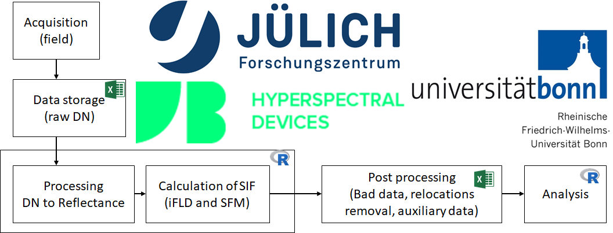

<style>
body {
text-align: justify}
</style>



***

```{r setup, include=FALSE}
knitr::opts_chunk$set(echo = TRUE, cache = F, fig.width = 9, message = FALSE, warning = FALSE)
```

### Data sources 

This analysis used one main dataset consisting of Sun-induced fluorescence (SIF) obseravations collected on 1-2.08.2018 inside a sugar beet field. The measurements were performed using FLOX - a field spectroscopy device manufactured by [JB Hyperspectral](https://www.jb-hyperspectral.com/). For more information about the actual data acquisition procedure on the groud, sensor setup, and the study field see [Methods]() chapter. 

The dataset consist of SIF measurements over six locations along one transect. The transect was measured twice in one day - in the morning and early afternoon hours. After processing the raw DN from the FLOX using the provided processing algorythm, the output file consist of the following variables. 

```{r, include=FALSE}
load("data/poster_intput.rdata")
```

```{r}
library(tidyverse)
library(readxl)
meta <- list()
meta[["flox"]] <- read_excel("data/meta.xlsx", sheet = "flox")
```

### FLOX variables 
```{r}
table1 <- knitr::kable(meta$flox, caption = "Metatable of FLOX variables with units and description", format = "html")
kableExtra::column_spec(table1, 1:2, width = "4cm", bold = TRUE)
```

### Auxilary variables 

To that table we appended variables designating ID for each location, and weather it was the morning or the afternoon measurement, the LAI measured with Sunscan. 

```{r}
meta[["aux"]] <- read_excel("data/meta.xlsx", sheet = "aux")
table2 <- knitr::kable(meta$aux, caption = "Metatable of additional variables added by user", format = "html")
kableExtra::column_spec(table2, 1, width = "3cm", bold = TRUE)
```


### Overview

Here we produce a plot showing the average SIF 760 value for each location (in the morning and in the afternoon) and the transect inside the sugar beet field.

```{r, fig.width=9}
# plot SIF vs. Time
p1 <- ggplot() +
  geom_point(data = mobile.sb5, aes(x = `datetime [UTC]`, 
                                y = SIF_A_ifld,
                                shape=unique.loc,
                                size = 2, stroke =2)) + 
    scale_shape_manual(values=seq(0,18)) + 
    xlab("Time (UTC)") +
    ylab(expression("SIF 760 ["~mW%.%m^{-2}%.%sr^{-1}%.%nm^{-1}~"]")) +
  theme_bw(base_size = 12) + 
    theme(legend.position="none") + 
    labs(title = "Morning and afternoon SIF measurements", subtitle = "Method: iFLD, Crop: Sugar beet")
p1
```

```{r, fig.width=9, fig.height=9, fig.cap="Coordinate reference system: EPSG:32632, Datum:WGS 84, Projection:UTM Zone 32N"}

#raster image as basemap
library(raster)
icc <- raster::stack("data/icos_color_composites")
selras.trcol <- icc[[3:1]]
selras.facol <- icc[[4:2]]
# if needed rename
# names(selras) <- substr(names(selras), 13, 24)
# cut to sugar beet extend
win2 <-
  raster::extent(320600.6, 320900.0, 5637550, 5637800) # the sugar beet field
icos.ras <- raster::crop(selras.facol, win2)
icos.sb <- as.data.frame(as(icos.ras, "SpatialPixelsDataFrame"))

# ggplot map using rggbplot 
m1 <- rggbplot(raster::crop(selras.trcol, win2), npix = 5000000) 
m2 <- m1 +
  geom_point(data = mobile.sum, 
             aes(magvar, geoidheigh, shape=unique.loc, fill = "black", size = 2, stroke =2)) +
  scale_shape_manual(values=c(0:5)) + 
  labs(x = "Easting (m)", y = "Northing (m)", title= "Transect in sugar beet", subtitle = "Basemap: True colour composite (2.8.2018)") +
  theme(legend.position="bottom") +
  scale_y_continuous(breaks = 
                       seq(extent(icos.sb)@ymin,extent(icos.sb)@ymax,by=100)) +
  scale_x_continuous(breaks = 
                       seq(extent(icos.sb)@xmin + 48.5, extent(icos.sb)@xmax, by=100)) +
  coord_equal() + 
  theme_bw(base_size = 12) +
  theme(legend.position = "none", axis.text.y = element_text(angle = 90, hjust = 0.5))

m2
```


```{r, include=FALSE}
save.image(file = "data/meta_out.RData")
```

